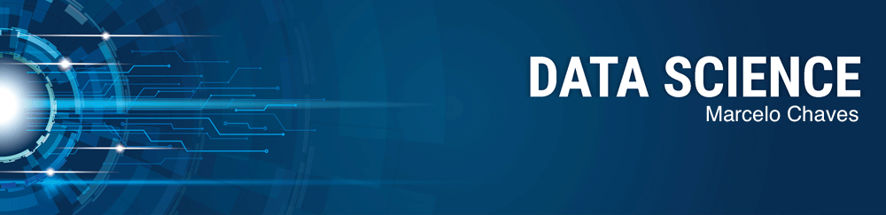

# Sigmoidal-Data-Science

  

# Marcelo Chaves

As a Data Scientist I combine analytical skills, ability to work in team environments and attention to details. Having spend the last years applying Machine Learning to solve real problems, I developed a critical thinking and problem-solving skills.

Born in Brazil and living in the United States for over 20 years, I speak 3 languages fluently. Portuguese, English and Spanish.

**Background in:** Python, Machine Learning.

**Links:**
* [LinkedIn](https://www.linkedin.com/in/marcelo-chaves-9a5920261/)
* [Medium](https://medium.com/@marcelochavesoficial)

## Projects:

* **Como usar o Histograma para Data Science:** https://bit.ly/2L2cMwy
* **Como Implementar Regressão Linear com Python:** https://bit.ly/2Li5pzY
* **Data Science: Investigando o naufrágio do Titanic:** https://bit.ly/2Ubr5SH
* **Como Tratar Dados Ausentes com Pandas:** https://bit.ly/31KWSMN
* **XGBoost: aprenda este algoritmo de Machine Learning em Python:** https://bit.ly/2UbRhws
* **Como criar uma Wordcloud em Python:** https://bit.ly/2OxsphM
* **Como lidar com dados desbalanceados:** https://bit.ly/2ZlaNsV

---
